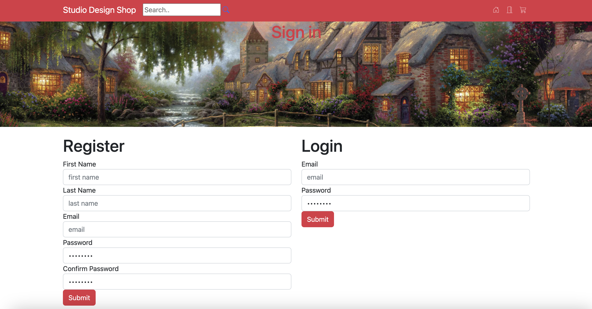
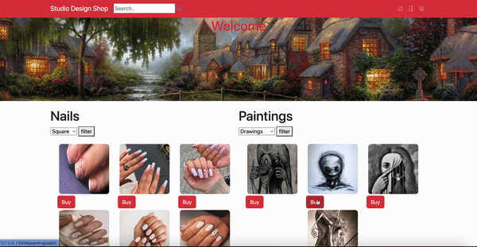

  

Hello my name is Eric, I am 20 years old, I love all kinds of fitness, whether that be outdoor activities, hiking running, going on walks and soccer. On the side I have a vested interest in learning more about investing. I grew up in the bay area and after completing my k-12 I was recommended through a family friend to take a look at coding. I am a software developer with a passion for all things tech related, whether that be the new M2 chip the latest phones, tesla autopilot, etc. Coding has just been the perfect fit for me and through the bootcamp I began to realize my passion for coding. I'm yearning to join a software team where i'll bring great communication, outside the box thinking and technical skills

___

## Table of Contents
* [⛩️🇯🇵Tokyo Travel Planner](#Tokyo-Travel-Planner)
* [💅🎨Studio Design Shop](#Studio-Design-Shop)
* [🎹🎧Spotify Imitation](#Spotify-Imitation)

___

## Where to find me

___

## 🧰 Languages and Tools

    
    
    
    
    
    
    
    
    
    
    
    
    
    
    
    

   

___

## **[⛩️🇯🇵Tokyo Travel Planner](https://github.com/Eric-Barajas/DestinationTokyo)** 
Tech Stack: Java, MySQL, Spring Boot, BootStrap

A full stack travel planner website dedicated to foreigners planning their stays in Tokyo. In addition to providing users the ability to explore all tokyo has to offer. Users also have the ability to write their own reviews on the locations they traveled to, as well as revise and delete their own comments.

<h4> 🍙 Comments </h4>

<h4> 🍱 Layout </h4>

<h4> 🍜 Map </h4>

[Return to Table of Contents](#Table-of-Contents)

___

##  **[💅🎨Studio Design Shop](https://github.com/Eric-Barajas/nails_and_paintings)**

<h4> ✍️ You first Log in or make an account  </h4>

  

<h4> 🛍️ You browse the items and select add whatever item you want to your cart </h4>

  

<h4> 🛒 You can click on the cart icon to see the list of items you have added to your cart </h4>

  

[Return to Table of Contents](#Table-of-Contents)

___

## **[🎹🎧Spotify Imitation](https://github.com/Eric-Barajas/spotify-clone-app)**

<h4> 🎷 Fake Spotify </h4>

  

<h4> 🎸 Actual Spotify </h4>

  

[Return to Table of Contents](#Table-of-Contents)

___

